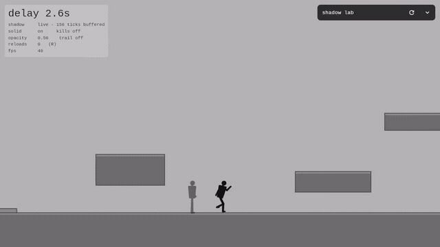
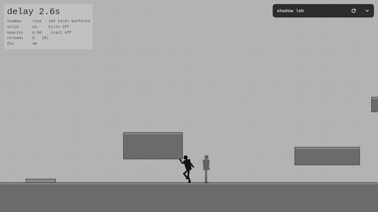
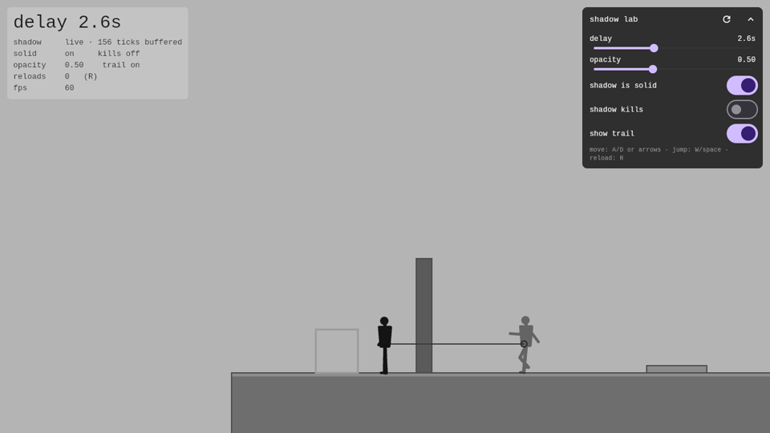
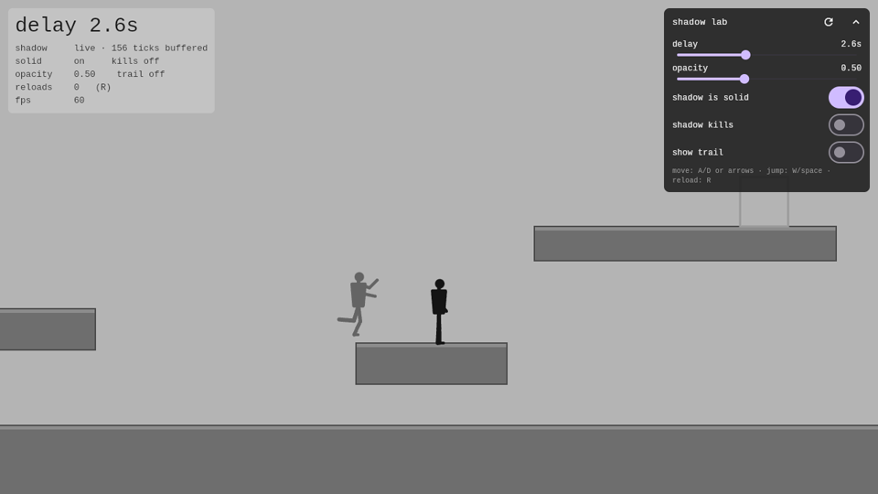
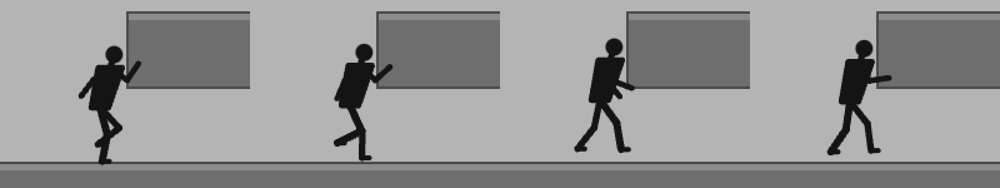

# waraya · ورايا

A 2D atmospheric side-scroller set in contemporary Egypt, built with Flutter +
Flame. One codebase for mobile, desktop and web.

**You do not control your shadow. You control what your shadow will do in `D`
seconds.** It repeats everything you did, that long ago, and it is a real thing
in the world while it does it — something to stand on, something in your way,
something that can catch you.



*The black figure is the player. The grey one is doing what the player did 2.6
seconds ago — the number is on screen, top left.*

## The idea

If you want a plate held down over there, you have to go and stand on it
yourself, `D` seconds before you need it — then walk away and be somewhere else
when your own past arrives to press it. So you spend the game doing things that
look pointless, knowing they are the solution to a problem you have not reached
yet.

One rule, several uses: a button you cannot reach in time, a platform that is
your own body, an obstacle that is where you just were, a sacrifice you make
now so the shadow can undo it later.

The delay is never under your control. There is no record button and no rewind
— the mechanic runs whether you are ready or not, which is what makes it feel
closer to being chased than to a quiet puzzle box.



## What it actually looks like


Everything dark in that frame except the character is a photograph of a real
place, cut to a silhouette and parallaxed. The haze between the layers, the
dust in the air and the light shafts are all painted with ordinary blend modes
— there is not a single shader in the project, which is why it runs the same on
a phone, a laptop and in a browser.


The puzzles run in that scene now. They did not to begin with, and the order
matters: the mechanic was proved on grey boxes first, because a good-looking
scene flatters a boring idea and you do not find out for months. The levels
moved in only once they stood up without the help.

The scene is paint, not geometry — same class, same rectangles, same numbers,
with the look chosen at the entry point. A test plays the whole campaign again
with the scenery switched on and requires the same recorded solutions to still
work, so dressing a level can never quietly move something the player can
touch. The tuning bench (`lib/main_lab.dart`) stays grey on purpose.

## What's built

| Phase | | |
|---|---|---|
| 1 | Environment, camera, atmosphere, character | ✅ |
| 2 | The delayed shadow, on a grey-box test scene | ✅ |
| 3 | Game feel — weight, coyote time, sound, screen shake | ✅ code, tuning open |
| 4 | Puzzle design, 5–8 levels | ✅ 7 built |
| 5 | Death and retry, level transitions, saving, menus | ✅ |
| 6 | Level vocabulary — new data a level can be made of | keys and inverted plates in |
| 7 | The hard levels, built out of that vocabulary | |
| 8 | Server, submissions, authoring | |
| 9 | Polish and release | |

Phase 6 adds **vocabulary, not levels**. Seven levels used up most of what
rectangles, plates and doors can say, and "harder" with the same pieces only
means longer walks. The first of the new pieces is a **key**: it flips its door
on the edge, the instant a body steps on it — and the body four seconds behind
you steps on it too. So it is the first thing in the game your past *undoes*
rather than does, and the level that proves it is won by touching it and
walking away rather than by waiting for yourself to arrive.

It is a hobby project, built one day a week. The plan it follows, and the
reasoning behind each phase, is in [`CLAUDE.md`](CLAUDE.md), with the current
phase in [`docs/phase-6-vocabulary.md`](docs/phase-6-vocabulary.md).

## Playing it

**<https://3shmawi.github.io/waraya/>** — the introduction, and one button to
the game at `/play/`. In the browser, no install. Every push to `main`
republishes both (`.github/workflows/pages.yml`).

Arrows or **WASD** to walk, **space** to jump, **down** to crouch, **R** to put
the level back if you have painted yourself into a corner — which in one of
them is the intended way to find out you did. On a phone there are four drawn
buttons: two arrows bottom left, jump and crouch bottom right.

**R** (or «من الأول» at the top) puts the level back. **Escape** (or
«المراحل») opens the level list. Progress is kept
per level id, so closing the tab and coming back puts you where you stopped.

The game says none of the controls: no prompts, no tutorial, and that stays a
Phase 5 question rather than something bolted onto a level. So the two places a
player is already waiting or reading say it instead — the landing page, and the
loading splash. A CanvasKit build takes a couple of megabytes to paint the
first frame, and that wait is the one moment in the whole game with room for a
sentence.

## Running it

The Flutter version is pinned in `.fvmrc`. Install [FVM](https://fvm.app), then:

```bash
fvm install                                  # fetches the pinned SDK
fvm flutter pub get

fvm flutter run -t lib/main_levels.dart      # the puzzles
fvm flutter run -t lib/main_lab.dart         # the tuning bench
fvm flutter run                              # the finished environment
```

**Three entry points.** `main_levels.dart` is the campaign — the puzzles, in
teaching order. `main_lab.dart` is the same game on a bench scene with a live
panel for the delay, the shadow's opacity, and whether the shadow is solid,
kills you, or shows the path it is about to walk. `main.dart` is the Phase 1
scene with nothing to solve in it — one walker, one horizon.

The bench stays grey on purpose. Nice art flatters a mechanic, so the puzzles
had to stand up without it before they were allowed to move into the scene —
and the place the numbers get argued with is still the place with no scenery in
the way.

```bash
fvm flutter analyze
fvm flutter test
```

`.fvmrc` is committed and `.fvm/` is not, so everyone resolves the same SDK
without the download living in the repository. Plain `flutter` works if your
global SDK happens to match; only `fvm flutter` is guaranteed to be the pinned
one. Build gotchas worth knowing about are in [`docs/building.md`](docs/building.md).

## The puzzles


That is the first level, start to finish. The plate is in the opposite
direction from the door, so you walk the wrong way, stand on something
pointless, walk all the way back — and the door opens on its own as your own
past arrives at the plate behind you.

**Every level ships with a recorded solution, and a recording of the obvious
wrong idea.** A test replays both through the real game: the first has to
finish the level, the second has to fail to. Another plays every level back to
back in one game, which is the only way to catch a handover that leaves
something behind. The second kind is what matters.
The first draft of that level put the plate on the way to the door, so walking
left crossed it, and three seconds later the shadow crossed it too and opened
the door for a player who had done nothing — a puzzle you beat by holding one
key. The test caught it.

Levels are data (`lib/level/level.dart`): rectangles, a spawn, a goal, and the
three numbers that change how the shadow behaves. The delay is one of them, per
level, because the same layout at two seconds and at five is two different
puzzles.

### What playing it found that the tests could not

The first report from a real playthrough was "level three keeps restarting",
and it was right. The door was held open for exactly as long as the player had
stood on the plate — under a second — and that window arrived exactly five
seconds later. Stop to think for two seconds, which is what people do, and you
are on a sixteen-unit shelf with a shut door in front of you and your own past
walking up behind you. No door, no room to dodge, nothing to do.

The fix is a door that latches open, off by default because a door that shuts
again as you walk away is the first level's entire lesson. Tests now play that
level pausing for one, two and three seconds and require it to finish without a
death. The rule it left behind: make a level harder by giving it more to work
out, never by giving less time to do it in.

## The tuning bench



Every measurement in that scene is load-bearing, and tests pin them: the ledge
is too high to reach without standing on the shadow, the door is too tall to
jump, and the tunnel is too low to walk through. Change the character's jump
and a test fails rather than a puzzle quietly becoming trivial.



A solid shadow is a **one-way platform** — you land on it from above, you do
not walk into it. It is placed from a buffer rather than moved by physics, so
it can appear inside you, and a fully solid one would wedge you into the
geometry.

## Two decisions worth not re-litigating

**1. Fixed world height, elastic width.** The camera uses the default
`MaxViewport` and `onGameResize` sets the zoom so exactly
`WarayaConfig.worldHeight` (720) world units are visible vertically. A tall
phone sees a narrower horizontal slice, a wide desktop sees a wider one, and
nothing gets letterbox bars. **Art must therefore be authored wider than the
widest viewport** — the placeholder layers span 12000 units for this reason.

The camera tracks the walker horizontally only; its vertical position is pinned
so the horizon stays where the art was composed for it.

**2. All input arrives as `InputIntent`.** Nothing below `WarayaGame` asks what
platform it is on. `InputController` merges every `InputSource` once per frame,
before anything consumes it. Sources are all live simultaneously rather than
selected by platform, so a phone in a desktop browser still gets touch and a
tablet with a keyboard gets both. Adding a gamepad means adding one list entry.

- Keyboard: arrows / WASD to move, space / up / W to jump, S / down to crouch.
- Touch: hold the lower left or right to move, the strip between them to
  crouch, the upper band to jump.

Jumping clears about 136 units — a little over the character's own height.
Holding the key jumps that high; tapping it hops.

**3. The shadow records where the body went, not which key was pressed.**
Every fixed tick, the character's position, facing and pose go into a queue,
and `delaySeconds` later the oldest entry comes out the far end and the shadow
puts itself there. The shadow has no physics of its own.

That is the difference between this and the games that have done delayed
replay before. Re-simulating a recorded *input* needs deterministic physics,
and Flame hands you a variable `dt`; in a puzzle where the shadow has to stand
on a plate, a few units of drift is the player solving it correctly and the
game saying no. Recording the *result* cannot drift — there is a test that
asserts the replay matches to exact equality, with no tolerance.

It also means everything in the game-feel pass below — speeds, gravity, coyote
time — could be re-tuned without invalidating a single recording.

### Atmosphere

Four layers, none of them a shader, so none of them can break on a web build the
way the plan warns fragment programs do.

`haze_veils.dart` is the one doing the work: a dust storm is mostly air thick
enough to hide the middle distance and then let it back. One soft blob is baked
at load and drawn a dozen times at different sizes, speeds and opacities.

`god_rays.dart` bakes its whole fan into one blurred image and draws it once per
frame. Drawing the wedges directly gave them hard geometric edges that read as
cones rather than light, and softening them per frame would have meant blurring
every frame. **A dust storm scatters light rather than beaming it**, so there is
no sun disc here to justify strong shafts: `strength` defaults to 0.07 and
setting it to 0 is a defensible call for this scene, not a missing feature.

`dust_field.dart` puts motes in the viewport rather than the world, because
airborne dust is carried by the wind and should not slide past at the camera's
speed. Each depth layer is one `drawRawPoints` call.

**Unmeasured:** all of this is full-screen overdraw, which is the thing most
likely to cost frames on mid-range mobile, and the frame rates in this
repository's screenshots come from a software renderer and mean nothing. The
dials to turn down first are `HazeVeils.count` and `maxOpacity`, then
`GodRays.strength`, then `DustField.motesPerLayer`.

### The road has no end

Every generator used to build its contents once, over a fixed 40000-unit span.
Walking past about 20000 units ran off the world: the poles, palms, weeds and
road all stopped and only the camera-relative bands carried on.
`endless.dart` derives each item from its own index instead, so any stretch can
be produced on demand, identically every time, with nothing stored and no seam
where a period repeats. Only the indices overlapping the view are built, and
they are cached.

Its hash is deliberately double arithmetic rather than integer mixing. On the
web an `int` is a double and bitwise operations are 32-bit, so the first
version's 54-bit mask did not merely run slowly there — dart2js refused to
compile the literal, and the build passed everywhere else. `endless_test.dart`
pins generation at ±400000 units.

### The character is posed, not animated

`character/figure.dart` solves a pose from a stride phase instead of playing a
sprite sheet. This is a silhouette game, so a sheet would carry no texture or
shading this cannot, and a solved pose buys two things a sheet does not: the
phase advances with **distance covered** rather than with time, so the feet stay
planted at any walk speed and any frame rate, and the legs come from two-bone
inverse kinematics against a foot tracing a flattened ellipse, which is what
stops a walk cycle looking like two sticks rotating about a hip.

Proportions are fractions of body height, so the whole figure scales from one
number. Far limbs draw, then the torso, then near limbs — drawing both arms
before the body hid them behind it and left the figure looking one-armed.



The gait is a run rather than a walk because at 220 units per second a
96-unit-tall character covers 2.3 of its own heights every second, which is a
running speed; a walk cycle at that speed reads as being dragged along the
ground. The body lifts at the two points in the stride where neither leg
carries weight, which is the flight phase that separates the two.

## Layout

```
lib/
  main.dart                      the game
  main_lab.dart                  the shadow lab
  shadow/
    snapshot.dart                one tick of the body: where, facing, pose
    fixed_ticker.dart            60Hz out of a variable frame rate
    shadow_recorder.dart         the delay line
    shadow_figure.dart           the shadow: takes snapshots, has no physics
  lab/
    lab_scene.dart               the grey-box geometry, as plain rectangles
    lab_player.dart              box collision against it
    lab_props.dart               plate, door, goal, debug trail
    lab_settings.dart            the live tunables
    shadow_lab_game.dart         the lab, assembled
  game/
    config.dart                  every tuned number, in one file
    waraya_game.dart             the finished scene
    screen_shake.dart            landing flinch
    character/figure.dart        the silhouette, posed from a stride phase
    character/locomotion.dart    speed, gravity, coyote time, jump buffer
    probe_walker.dart            the character in the finished scene
    atmosphere/                  dust, haze, god rays, vignette
    ground.dart, photo_band.dart, palm_row.dart, power_line.dart, endless.dart
  input/
    input.dart                   InputIntent + InputSource
    input_controller.dart        per-frame merge
    keyboard_input_source.dart, touch_input_source.dart
  audio/
    sfx.dart                     the sounds, and the silent seam
    step_detector.dart           footsteps from the stride phase
    flame_audio_out.dart         the only file that imports an audio library
  ui/
    debug_hud.dart, lab_hud.dart, lab_controls.dart
```

Render order inside the camera is **backdrop → world → viewport**. The sky sits
in `camera.backdrop`; a sky in the viewport paints over the entire scene.

## The assets are generated, not drawn

There is no artist on this project, so nothing is drawn by hand and nothing is
a mystery binary. Both scripts live next to what they produce:

```bash
python3 tools/silhouette.py photo.jpg -o assets/images/layer_far.webp --tile
python3 tools/sfx.py --verify
```

`silhouette.py` turns a backlit photograph into a tileable silhouette layer —
soft luminance matting, because a hard threshold eats the wires and palm
fronds that make an Egyptian skyline read as Egyptian.
[`docs/phase-1-art-pipeline.md`](docs/phase-1-art-pipeline.md) has the details
and an honest account of what the source photographs did and did not yield.

`sfx.py` synthesises all seven sound effects from noise and low sweeps, stdlib
only. `--verify` prints each sound's length, level and brightness, which is how
you check a click is still a click without listening to it. **Do not hand-edit
the wavs** — they are build output. Change the function and run it again.

## Docs

- [`CLAUDE.md`](CLAUDE.md) — the project plan, and the current phase
- [`docs/phase-2-shadow-prototype.md`](docs/phase-2-shadow-prototype.md) — how
  to run the three tests the shadow was judged by, and the verdict
- [`docs/phase-2-plan.md`](docs/phase-2-plan.md) — the plan that phase followed
- [`docs/phase-1-research.md`](docs/phase-1-research.md) — the original research
- [`docs/phase-1-art-pipeline.md`](docs/phase-1-art-pipeline.md) — making the layers
- [`docs/building.md`](docs/building.md) — build notes worth an afternoon each

## Credits

The bundled font is **Liberation Mono**, under the SIL Open Font License; the
licence ships in the bundle and is registered at runtime, which is what the OFL
asks for. Source photographs in `art/source` are the author's own.

The setting is contemporary, working-class Egypt, and it is meant to be shown
with warmth rather than as spectacle. Nothing pharaonic — that was ruled out at
the start, and it is the one art direction note that is not negotiable.
