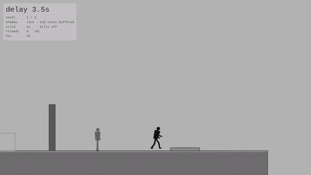

# Phase 4 — تصميم الألغاز

**الهدف:** ٥–٨ مراحل تعلّم الميكانيك وتبني فوقها. لسه تلاتة.

## إزاي تشغّلهم

```sh
flutter run -t lib/main_levels.dart     # المراحل
flutter run -t lib/main_lab.dart        # الورشة (الـ sliders)
flutter run                             # البيئة الحلوة (Phase 1)
```

## القرار المعماري: المرحلة **بيانات** مش كود

`lib/level/level.dart` — المرحلة قيمة: مستطيلات، مكان بداية، نهاية، وتلات
أرقام بتغيّر سلوك الظل. مش كود بيرسم مشهد.

ليه؟ لأن اللغز اللي مش مقدر تقراه غير وانت بتقرا الكود اللي بيرسمه، حد
هيظبطه. ولأن القيمة دي تقدر **تتلعب في تست**.

**التأخير بقى per-level.** نفس التصميم بـ٢ ثانية وبـ٥ ثواني لغزين مختلفين
تماماً — ودي واحدة من استخدامات الميكانيك في الخطة أصلاً.

## أهم حاجة في الـ Phase دي: كل مرحلة معاها حل مسجّل

`test/level/levels_test.dart` بيشغّل اللعبة الحقيقية ويشغّل عليها **تسجيل
لحل المرحلة**، ويتأكد إنها خلصت فعلاً. وكمان بيشغّل **تسجيل للفكرة الغلط
البديهية** ويتأكد إنها *مخلصتش*.

التانية دي أهم من الأولى. أول نسخة من المرحلة الأولى كان الزرار في الطريق
للباب — يعني بتعدّي عليه وانت رايح، وبعد ٣ ثواني ظلك بيعدّي عليه ويفتحلك
الباب وانت مش عملت حاجة. **مرحلة بتتحل بإنك تمسك زرار واحد مش مرحلة.**
التست كشفها، والزرار اتنقل في الاتجاه المعاكس للباب.

لو غيّرت ارتفاع النطة بعدين، المراحل هتقع في CI بدل ما تكتشف وانت بتلعب إن
واحدة بقت مستحيلة.

## المراحل

### ١ — قبل ما تحتاجه (تأخير ٣.٥)



زرار في اتجاه، باب في الاتجاه التاني. تقف على الزرار، تمشي ناحية الباب،
وظلك يوصل الزرار وانت عند الباب.

مفيش نط ومفيش موت. الحاجة الجديدة الوحيدة هي الفكرة نفسها.

### ٢ — اوقف على نفسك (تأخير ٣.٥)

رفّ على ارتفاع ١٩٠ وحدة — ونطتك ١٣٠. مستحيل توصله برجليك.

دماغ الظل على ارتفاع ٩٦، ومن فوقها النطة بتوصل. يعني لازم تقف في مكان
ملهوش لازمة، تمشي من مكانك، وترجع تلاقي جسمك بقى سلّمة.

### ٣ — مش نفس السكة (تأخير ٥، والظل بيقتل)

ممر فيه مسارين: واحد على الأرض وواحد فوقه. تدخل على الأرض، تدوس الزرار في
آخر الممر، وترجع — بس ظلك دلوقتي بيمشي في نفس السكة، والباب مش هيفتح غير
لما يوصل الزرار.

**البداية جنب الباب بقصد.** الخطة البديهية إنك تخرج بسرعة وتستنى عند الباب
— وده بالظبط المكان اللي ظلك بيبدأ منه. فالاستنى على الأرض = موت، والمسار
الفوقاني هو المكان الوحيد اللي تستنى فيه.

## اللي اتصلح في السكة

**باب بيتقفل عليك كان بيرفعك فوق سطحه.** الـ collision كان بيعتبر "متداخل
ونازل" = "نزلت عليه". دلوقتي بيرفعك بس لو كنت فعلاً واقع عليه من فوق؛ غير
كده بيزقك على الجنب. لقيته وانا بصوّر كليبات الـREADME.

**الظل كان يقدر يقتلك بعد ما تخلص المرحلة** — في الثانية اللي بين لمس
النهاية وتحميل اللي بعدها، وده كان بيلغي إنك خلّصت.

## اللي فاضل في الـ Phase

- **مرحلتين لسه على الأقل**: التضحية (ترمي نفسك في مكان مالكش رجعة منه وانت
  واثق إنك دُست الزرار)، والجمع بين اتنين في مرحلة واحدة.
- **خط عربي.** أسامي المراحل والتلميحات مكتوبة في البيانات بالعربي، بس
  الخط المضمّن (Liberation Mono) مفهوش حروف عربية، فالـHUD دلوقتي بيعرض
  رقم المرحلة بس. عرض العربي محتاج خط يتضاف بترخيصه زي ما اتعمل مع Liberation
  — شغل حقيقي مش سطر.
- **الانتقال بين المراحل** دلوقتي قصّة: تلمس النهاية، تستنى ٠.٩ ثانية،
  المرحلة اللي بعدها. التلاشي والحفظ والقوايم دي Phase 5.
